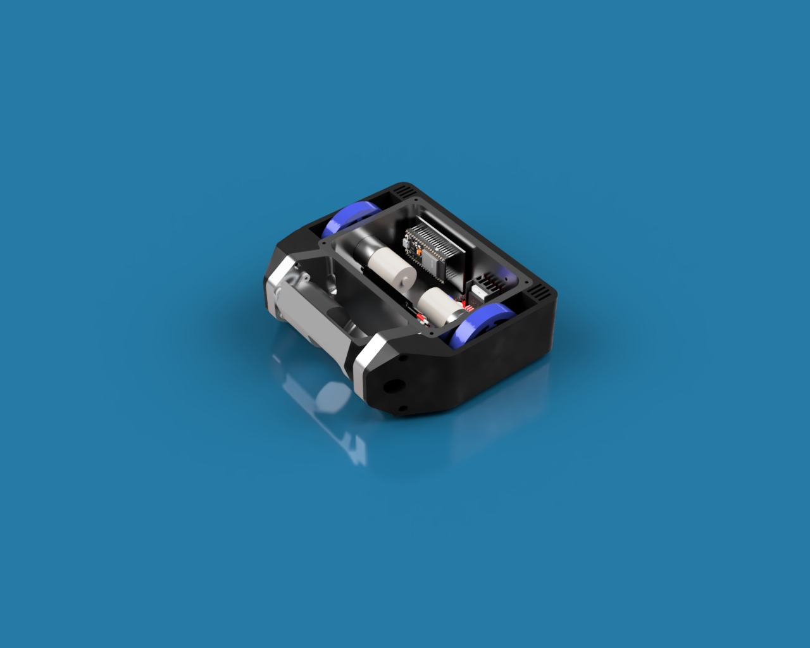

# 🤖 Bumblebeetle - Beetleweight Combat Robot
  O projeto 'BumbleBeetle' é um robô de combate da categoria de 1.36kg. Tal projeto, é composto por uma pequena arma giratória caracterizada como DRUMS.  
    

### ⚙️ Especificações Técnicas

- **Categoria:** Beetleweight (1,36kg)  
- **Arma:** Tambor giratório horizontal  
- **Motor da arma:** PropDrive 28-36 3000kv  
- **Tração:** 2 rodas de silocone  
- **Bateria:** LiPo 3S 11.1V 2200mAH

### 📟 Eletrônica

- **Microcontrolador:** ESP32 DevKit V1  
- **Controle:** Via Bluetooth usando um controle de PS3  
- **Motor de Locomoção:** 2x Motor com Caixa de Redução 12V 500RPM  
- **ESC:** Flysky Raptor5 50A

### ⚡ Principais Características

- **Arma de aço 1045 com têmpera**
- Chassi Impresso de TPU

